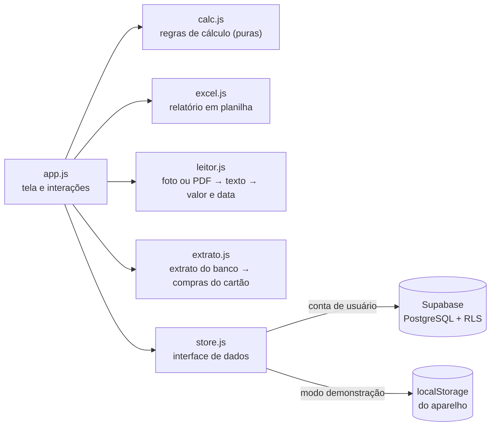
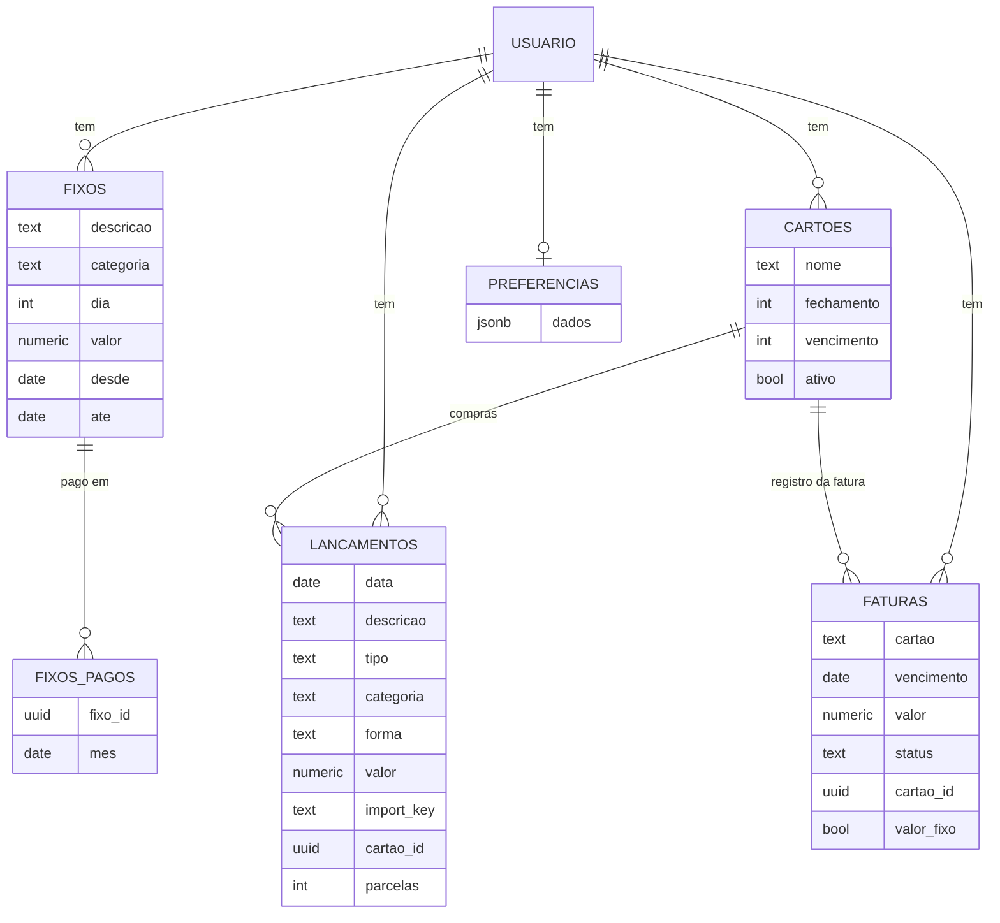

# Meus Gastos — controle de gastos pessoal (PWA)

App web instalável no celular para **lançar gastos no dia a dia e acompanhar quanto o mês vai custar**. Cada pessoa tem sua conta, e os dados ficam salvos na nuvem com segurança por usuário.

**[▶ Abrir o app](https://meugastos.com.br/)** · **[Site de apresentação](https://meugastos.com.br/site/)** · tem um modo demonstração, não precisa criar conta para testar.

<p align="center">
  
  &nbsp;
  
</p>

<p align="center"></p>

## O problema

Eu controlava meus gastos numa planilha do Excel que só mostrava o saldo depois que o mês acabava. Queria ver **durante o mês** quanto já tinha gasto, quanto ainda ia pagar de contas fixas e cartão, e para onde o dinheiro estava indo. Também queria lançar tudo pelo celular, na hora do gasto.

## Funcionalidades

- **Lançamento rápido** de gastos, entradas e dinheiro guardado, com categoria e forma de pagamento. Todo lançamento pode ser **editado** ou excluído.
- **Custo do mês em tempo real** e **previsão de fechamento**, que mistura o ritmo atual com a média dos meses anteriores e não repete compras pontuais grandes.
- **Gastos fixos** cadastrados uma vez: mensais (aluguel, internet) ou semanais (Uber de toda sexta, terapia), com marcação de "pago" a cada ocorrência. Quando o valor muda (o aluguel subiu), a alteração pode valer **só do mês em diante**, sem mexer nos meses anteriores.
- **Entradas fixas**, como o salário: cadastradas uma vez, são lançadas sozinhas em todo mês, no dia escolhido.
- **Cartão de crédito com fatura automática**: a pessoa cadastra o cartão com o dia de fechamento e o de vencimento, e o app monta cada fatura sozinho a partir das compras, incluindo as **parceladas** e os fixos cobrados no cartão. O que é comprado no cartão só pesa no mês em que a fatura vence. Dá para abrir a fatura, ver o que tem dentro, corrigir o valor se o banco cobrou diferente e marcar como paga. Faturas também podem ser lançadas à mão.
- **Importar o extrato do cartão**: o arquivo que o banco exporta (CSV, OFX ou Excel) vira uma lista de compras para conferir, com categoria sugerida, e todas são lançadas de uma vez no cartão. A fatura é montada pela soma delas. Parcelas, pagamento da fatura e estornos são reconhecidos, e importar de novo um arquivo mais recente só traz as compras que faltam. No OFX (o formato que o Nubank exporta), o app também aproveita o nome do banco, o período da fatura e o vencimento para escolher a fatura certa e, se ainda não houver cartão, cadastrá-lo com os dias que vêm no arquivo. Um arquivo de exemplo está em [`modelo/extrato-cartao-exemplo.csv`](modelo/extrato-cartao-exemplo.csv).
- **Atalhos do dia a dia**: busca nos lançamentos de todos os meses (descrição, categoria, forma de pagamento ou valor); "Você costuma lançar", com os gastos mais repetidos a um toque; "Lançar de novo hoje" em qualquer lançamento; e, ao digitar a descrição, as descrições já usadas aparecem para completar com um toque, trazendo o que foi feito da última vez (categoria, forma de pagamento e cartão). O app diz o que preencheu e não mexe no que a pessoa escolheu à mão. A tela de lançar abre com o foco no valor e o teclado numérico já aberto, também no iPhone.
- **Lançar por voz**: na tela de lançar, **Falar o gasto** e dizer, por exemplo, "gastei 32 no mercado no débito", "paguei 150 de luz no pix ontem", "comprei um tênis de 300 em 3 vezes no cartão" ou "recebi 500 do freela". O app entende valor (também por extenso), descrição, forma de pagamento, data, parcelas e se é gasto, entrada ou guardado, preenche o formulário e espera o toque em Lançar. O reconhecimento da fala é do navegador (Chrome no Android, Safari no iPhone); a interpretação está em [`js/voz.js`](js/voz.js), testada. Segurar o ícone do app mostra o atalho **Lançar por voz**.
- **Fechamento do mês**: nos primeiros dias de cada mês, o início mostra como o mês anterior fechou, com uma imagem pronta para compartilhar (sobrou ou faltou, entradas, custo, guardado e as categorias que mais pesaram). Dá para esconder os valores e mostrar só porcentagens. A imagem é desenhada no aparelho. Em meses passados, fica no link **Fechamento para compartilhar** do resumo.
- **Últimos meses e comparação**: entradas e custo de até seis meses lado a lado, com a sobra de cada um; e, por categoria, quanto o dia a dia está acima ou abaixo do mês anterior (até o mesmo dia, no mês em andamento).
- **Sem internet ou com sinal fraco**: o app abre na hora com os arquivos guardados no aparelho (o `sw.js` entrega a cópia e busca a versão nova por trás; quando ela chega, aparece "Atualizar") e com a cópia dos dados da última vez. Lançar responde no mesmo toque: o lançamento entra na tela e o envio acontece por trás. Sem conexão, ou sem resposta do servidor em 6 segundos, ele fica em uma fila no aparelho, aparece como "aguardando internet" e é enviado quando a conexão volta. Cada lançamento já nasce com o id final, então reenviar não duplica, nem quando o envio lento acaba chegando ([`js/store.js`](js/store.js), `comFila`).
- **Compartilhar para o app e atalhos** (Android, com o app instalado): no app do banco, Compartilhar → Meus Gastos abre o app já lendo o comprovante (`share_target` no manifesto, recebido pelo `sw.js`). Segurar o ícone mostra os atalhos Lançar gasto e Ler QR code.
- **Calendário de vencimentos**: o mês inteiro, com o que vence e o que entra em cada dia, a situação de cada conta (paga, a vencer, atrasada) e o "Já paguei" no próprio dia.
- **Leitor de QR code**: pela câmera, por uma imagem ou colando o "copia e cola", o app lê o Pix (valor e quem recebe, conferidos pelo CRC do código), o cupom fiscal (NFC-e e SAT) e o código de barras do boleto, e abre a mesma tela de conferência. O QR code do cupom de mercado é só um endereço da Fazenda: com a pessoa logada, a função [`supabase/functions/nota`](supabase/functions/nota) abre esse endereço e devolve valor, loja, data, forma de pagamento e itens. Ela só aceita endereço https de Fazenda estadual com chave de nota válida, não guarda nada e tem limite por pessoa. Testada com notas de São Paulo (o modelo "consulta resumida", usado também por outros estados).
- **Leitor por foto ou PDF**: a pessoa fotografa ou escolhe o arquivo de um comprovante (Pix, boleto, cupom, maquininha), da fatura do cartão ou do holerite, e o app preenche valor, data e descrição. Da fatura, lê só o total e o vencimento; do holerite, o valor líquido, que entra como entrada. PDF com senha é aberto depois de a pessoa digitar a senha. A leitura é feita no próprio aparelho, sem enviar o arquivo para servidor, e nada é salvo antes de a pessoa conferir.
- **Foto de papel**: antes de ler, o app iguala a luz (tira a sombra), apaga o que está em volta do documento, recorta no papel e endireita o texto. Se a primeira leitura não acha um valor firme e uma data, olha a foto de até três jeitos. Em boleto, guia e conta de consumo, o valor também sai da linha digitável ou do código de barras, conferido pelos dígitos verificadores; em recibo, do valor por extenso. Quando não tem certeza, diz isso e mostra os valores encontrados para tocar.
- **Primeiros passos**: conta nova começa com três perguntas (quanto recebe, contas de todo mês, cartão) e termina já mostrando quanto sobra. O que ficar para depois aparece na lista "Comece por aqui", no início, até ser resolvido ou dispensado.
- **Visual com cara de banco**: tema claro em azul-marinho e branco (o escuro continua em Ajustes), uma fonte só e números alinhados. No topo do início, **Livre para gastar** com a barra do quanto da sobra já foi usado, o **olho para esconder os valores** (fica guardado no aparelho) e as **ações rápidas**: Lançar gasto, Por voz, **Escanear e importar** (QR code, foto ou PDF de comprovante, extrato do cartão, tudo num lugar) e Recebi. Logo abaixo, Entradas, Custo até hoje e Projeção. A barra de baixo tem 5 itens iguais com nome (Início, Extrato, Lançar, Planejar, Mais), com o Lançar no meio. No extrato, cada linha diz o tipo (dia a dia, no cartão, entrada fixa…) e, ao lançar, o app mostra "Livre agora → depois".
- **Caixinhas e fotos**: o dinheiro guardado aparece em caixinhas, como nos bancos, cada uma com capa (foto ou cor), quanto tem e o progresso da meta, com Guardar e Retirar. Contas fixas também podem ter foto, que aparece nas listas. As fotos são reduzidas no aparelho e ficam nas preferências, valendo para os dois na conta de casal.
- **Resumo que se explica**: a tela abre com um número só em destaque, quanto sobra (ou falta) no mês, e a cor do quadro diz como o mês está: verde quando está sobrando, laranja quando ainda sobra mas a previsão fecha no vermelho ou o limite do mês está perto (80%) ou vai ser passado, e vermelho quando as saídas já passaram das entradas ou do limite. Uma frase curta explica o motivo. Logo abaixo, lado a lado, o custo até agora e a projeção do mês. "Entenda essa conta" mostra a régua colorida de para onde o dinheiro vai (contas fixas, dia a dia, faturas, guardado e sobra) e detalha a soma com os números da pessoa.
- **Quanto dá para gastar por dia**: a sobra dividida pelos dias que faltam, e a previsão de como o mês fecha no ritmo atual.
- **O que sobra para viver o mês** (no topo do Planejar e no link do resumo): o salário inteiro, menos o que já tem dono (contas fixas, faturas que vencem no mês, o guardado), dá a sobra para o dia a dia. Cada gasto lançado desconta dela, e a linha do tempo mostra quanto restou depois de cada um. O ritmo compara o que foi usado com o ideal pelo andamento do mês (sobra × dias que passaram ÷ dias do mês) e mostra quanto dá por dia e por semana. Regra em `sobraDoMes`, no `calc.js`.
- **Sair de qualquer tela do mesmo jeito**: todo quadro tem **Fechar** no canto de cima (além do botão de baixo), as telas cheias têm **‹ Voltar**, e o botão Voltar do celular fecha o quadro que estiver aberto, sem sair da tela de trás.
- **Seu dia**: o que foi gasto hoje, o botão "Não gastei nada" e a sequência de dias anotados, para criar o hábito de abrir o app.
- **Limites de gasto**: um limite para o mês e limites por categoria, em uma aba própria. O app mostra quanto do limite já foi usado, avisa na hora ao lançar e manda e-mail e notificação quando a pessoa chega a 80% do limite, passa dele ou passa em mais de 20%.
- **Próximos vencimentos logo abaixo**: as contas dos próximos 30 dias, com as atrasadas em destaque, contagem de dias ("em 10 dias vence a fatura, R$ 299"), botão "Já paguei" e alerta quando o mês está ou vai fechar no vermelho. O "Já paguei" funciona em um toque: a conta sai da lista na hora, a gravação acontece por trás e o aviso de baixo traz **Desfazer** para o toque sem querer. Se a gravação falhar, a conta volta para a lista.
- **Avisos por e-mail e notificação no celular**: de manhã, só nos dias em que há conta atrasada ou vencendo em até 3 dias. A pessoa liga e desliga em Ajustes.
- **Resumo da semana e lembrete do fim do dia**: no domingo à noite, um resumo por e-mail e notificação com o total da semana, a comparação com a anterior, as categorias que mais pesaram e as contas dos próximos 7 dias (só para quem anotou algo nas últimas duas semanas). O lembrete das 20h é uma notificação opcional, enviada só nos dias sem nenhuma anotação, que para sozinha depois de uma semana sem uso.
- **Acesso de quem comprou**: com a cobrança ligada, a conta sem compra (ou sem renovação) vê uma tela com o botão de comprar, "já comprei: conferir de novo", a demonstração e a opção de baixar os próprios dados. A regra vale no banco, não só na tela.
- **Dinheiro guardado** separado do saldo, por destino (reserva de emergência, investimentos e outros), com guardar e retirar.
- **Metas para o dinheiro guardado**: a pessoa diz quanto quer juntar em cada destino e, se quiser, até quando. O app mostra o progresso, em que mês ela chega lá e quanto dá para guardar com o que deve sobrar no mês. Um valor por mês vira um **combinado** que aparece em Próximos vencimentos com "Guardei" e "Pular": não é uma conta, não entra no custo e nunca fica atrasado. Ao guardar, o app comemora os marcos (25, 50, 75 e 100%); ao retirar, responde com apoio, sem cobrança. Por e-mail e notificação chegam os parabéns (no dia seguinte a guardar) e dois lembretes por mês, só quando deve sobrar dinheiro.
- **Saldo acumulado**: o que sobrou ou faltou passa para o mês seguinte, se a pessoa quiser, partindo de um **saldo inicial** (quanto ela já tinha, ou devia, quando começou).
- **Categorias personalizáveis** por usuário, na tela de Ajustes.
- **Gráficos**: custo acumulado no mês comparado às entradas, e custo por categoria.
- **Detalhe com um toque**: tocar em um quadro (custo, entradas, saldo, guardado, fixos, faturas) ou em uma categoria do gráfico abre a lista do que compõe aquele valor. Em todas essas listas e no calendário, cada item mostra de onde vem (**Dia a dia**, **Conta fixa**, **Com prazo**, **Parcela 2/12**, **No cartão**, **Entrada fixa**, **Fatura**) e **tocar nele abre a edição**. No calendário, uma conta marcada como paga por engano volta com **Não paguei**.
- **Relatório de gastos**: baixa uma planilha do Excel com os lançamentos, os fixos, as faturas e o resumo de cada mês do ano.
- **Contas com data para acabar**: acerto, acordo ou parcelamento que começa em uma data e vai até um mês escolhido. Ao lançar, a pessoa marca "Repete" e escolhe o último mês (a lista mostra quantas vezes dá e o total). A conta entra no custo só nesse período, e Contas fixas mostra quanto ainda falta de cada uma e a soma. Vale também para entradas ("fulano me paga até dezembro"). O "Vai até" mostra primeiro a quantidade ("36 vezes · até setembro de 2029") e tem o campo **Quantas vezes?**, que escolhe o mês sozinho.
- **Conta de casal**: duas pessoas, cada uma com o seu login, nas mesmas contas. Uma convida a outra pelo e-mail e o convite aparece dentro do app. As linhas continuam sendo de quem lançou (é assim que o app mostra "quem lançou" e é o que cada um leva ao sair); categorias, limites, metas e saldo passam a ser um só. A regra de acesso fica no banco (RLS com a função `meu_par()`), uma compra vale para os dois e os avisos consideram os registros dos dois. **Contra a mesma conta lançada duas vezes**: ao lançar, se já existe um lançamento de mesmo tipo e valor (da outra pessoa com até 2 dias de diferença, da mesma pessoa no mesmo dia) ou um fixo de mesmo valor no mesmo dia, o app pergunta "Isso já foi lançado?". O que já estiver repetido aparece em um aviso no início, com "Apagar este" ou "Não é repetido" (que vale para os dois). Regras em `mesmoLancamento` e `mesmoFixo`, no `calc.js`.
- **Navegação de celular como a dos apps do gênero**: barra de baixo com Início, Lançamentos, o "+" no centro, Planejar (limites e metas) e Mais; a tela Mais reúne, em grupos, contas fixas, cartões, calendário, conta de casal, relatório, ajustes e ajuda. Em "Organizar o início" a pessoa escolhe quais quadros aparecem.
- **A conta nas mãos da pessoa**: em Ajustes, ela troca a senha (confirmando a atual) e exclui a própria conta com todos os registros, confirmando com a senha. A exclusão é feita por uma função no banco que só aceita quem acabou de entrar ([`supabase/conta.sql`](supabase/conta.sql)).
- **Login por e-mail** com Supabase Auth e isolamento de dados por usuário, via Row Level Security no PostgreSQL.
- **Entrada sem tropeço**: tela separada em Entrar e Criar conta, e-mail lembrado no aparelho, senha com botão de mostrar. Em Esqueci minha senha, a pessoa recebe um código (e um botão) por e-mail e cria a senha nova ali mesmo; o botão de reenviar conta um minuto, para não invalidar o e-mail anterior. A demonstração tem o botão Criar minha conta e não fica gravada: quem abre o app instalado cai em Entrar / Criar conta.
- **Como usar**: no menu, respostas curtas para as dúvidas mais comuns (o que é o custo do mês, por que a compra no cartão não aparece neste mês, e outras).
- **Feito para o celular**: uma tela por vez, barra de navegação embaixo, botão "+" para lançar em tela cheia com teclado numérico e listas em formato de cartão, separadas por dia. Tocar em um lançamento abre a edição. Cada categoria tem a sua cor, a mesma no gráfico e nas listas. No computador, o mesmo app vira um painel completo.
- **PWA**: instalável no Android e no iPhone, abre em tela cheia. O tema escuro é o padrão, e o claro pode ser escolhido em Ajustes. Dentro do app, no celular, o quadro **Instale o Meus Gastos** e o item **Instalar o app** em Mais instalam com um toque onde o navegador permite; nos outros (iPhone, navegador da Xiaomi, Firefox) mostram o caminho daquele aparelho, com **Abrir no Chrome** quando ajuda.
- **Modo demonstração** com dados de exemplo guardados só no aparelho, para quem quiser testar sem criar conta.

## Tecnologias

| Camada | Escolha | Por quê |
|---|---|---|
| Interface | HTML, CSS e JavaScript puro (ES Modules) | Sem etapa de build: o repositório vai direto para o GitHub Pages |
| Gráficos | SVG desenhado à mão | Leve, responsivo e sem dependência |
| Banco de dados | Supabase (PostgreSQL) | SQL de verdade, com login pronto e plano gratuito |
| Segurança | Row Level Security | Cada usuário só lê e escreve as próprias linhas, garantido pelo banco |
| Excel | SheetJS | Leitura e escrita de `.xlsx` no navegador |
| Leitor por foto ou PDF | Tesseract.js (foto) e pdf.js (PDF), carregados só quando o leitor é usado | Leem o texto no aparelho, de graça e sem enviar o arquivo para fora |
| Leitor de QR code | Leitor do próprio aparelho (BarcodeDetector) ou jsQR, carregado só quando é usado | Lê o código no aparelho; o endereço de dentro do código nunca é aberto pelo app |
| App instalável | Web App Manifest + Service Worker | Ícone na tela inicial e abertura em tela cheia |
| Avisos | Supabase Edge Function + agendamento no banco (pg_cron) | E-mail (Resend ou Brevo) e Web Push, sem biblioteca externa |
| Testes | `node:test` | Regras de cálculo, importação, extrato do cartão, leitor e servidor de avisos testados sem dependências |

## Arquitetura



A tela não sabe onde os dados estão guardados: ela usa a interface de `store.js`, que tem duas implementações, uma para o Supabase e outra local para a demonstração. As regras de negócio ficam em `calc.js`, como funções puras, e por isso são fáceis de testar.

### Regras de cálculo

- **Custo do mês** = gastos do dia a dia fora do cartão + gastos fixos fora do cartão + faturas de cartão que vencem no mês.
- **Cartão**: compras e fixos no cartão não entram no custo na hora. A cobrança entra no mês de vencimento da fatura.
- **Em que fatura cai uma compra**: compras feitas antes do dia de fechamento entram na fatura que fecha naquele mês; do dia do fechamento em diante, na seguinte. A fatura vence no próximo dia de vencimento depois do fechamento.
- **Parcelas**: uma compra em N vezes entra em N faturas seguidas. Os centavos que sobram da divisão ficam na primeira parcela.
- **Valor da fatura**: a soma das compras, a menos que a pessoa corrija o valor à mão. No gráfico por categoria, cada compra da fatura aparece na sua categoria.
- **Fixo alterado a partir de um mês**: o fixo antigo é encerrado no mês anterior e um novo começa no mês escolhido. O passado não muda.
- **Saldo acumulado** = saldo inicial + saldo dos meses anteriores + saldo do mês.
- **Sobra do mês** = entradas − custo − dinheiro guardado; é o saldo do mês, mostrado em partes na régua.
- **Pode gastar por dia** = sobra ÷ dias que faltam no mês, contando hoje (zero quando não há sobra).
- **Limite do mês**: compara o custo do mês com o valor definido. Níveis de aviso: 80% do limite, acima do limite e mais de 20% acima. Cada nível gera um aviso por mês.
- **Entradas** = entradas lançadas + entradas fixas do mês.
- **Saldo do mês** = entradas − custo − dinheiro guardado no mês (guardou menos retirou).
- **Dinheiro guardado** = soma de tudo que foi guardado menos o que foi retirado, por destino.
- **Meta**: progresso = guardado no destino ÷ valor da meta. **Ritmo** = média do que foi guardado por mês nos últimos 3 meses fechados (contando do primeiro mês em que a pessoa guardou ali). **Previsão** = mês em que a meta fica pronta repetindo o combinado ou, sem combinado, o ritmo. Com data, **valor por mês** = o que faltava no começo do mês ÷ meses até a data. A conta usa só valor e tempo: o app não estima rendimento.
- **Sugestão do mês**: a parte do mês (combinado, valor por mês ou ritmo) limitada ao que deve sobrar (entradas − custo previsto − já guardado). Com menos de R$ 10 de sobra prevista, o mês conta como apertado e o app não sugere nem lembra nada.
- **Cor do resumo** (`estadoDoMes`): vermelho se a sobra é negativa ou o custo passou do limite do mês; laranja se a previsão fecha no vermelho, se a previsão passa do limite ou se 80% do limite já foi usado; verde nos outros casos; sem entradas nem custo, fica neutra. Meses fechados e futuros não olham a previsão.
- **Previsão** (mês atual): com histórico, mistura o ritmo do mês com a média dos últimos 3 meses, dando mais peso ao histórico no começo do mês. Sem histórico, mantém a média diária sem repetir compras pontuais grandes, e não projeta nada nos primeiros dias ou com poucos lançamentos.
- **Próximos vencimentos**: faturas em aberto e fixos não pagos do mês atual e do próximo, até 30 dias à frente, mais os atrasados. Fixos cobrados no cartão não aparecem soltos: são pagos junto com a fatura.

### Modelo de dados



A fatura de um cartão cadastrado não é guardada: ela é calculada a partir das compras. A tabela `faturas` guarda as faturas lançadas à mão e, para as calculadas, só o que a pessoa decidiu (se pagou, e o valor corrigido quando `valor_fixo` é verdadeiro).

O esquema completo, com as políticas de segurança e a visão `resumo_mensal` para análises em SQL, está em [`supabase/schema.sql`](supabase/schema.sql).

## Como colocar no ar (≈ 15 minutos, tudo gratuito)

### 1. Banco de dados (Supabase)

1. Crie uma conta em [supabase.com](https://supabase.com) e clique em **New project**.
2. Abra **SQL Editor → New query**, cole o conteúdo de [`supabase/schema.sql`](supabase/schema.sql) e clique em **Run**. Faça o mesmo com [`supabase/conta.sql`](supabase/conta.sql), que liga o "Excluir minha conta" do app.
3. Em **Project Settings → API**, copie a **Project URL** e a chave **anon public** e cole em [`js/config.js`](js/config.js).

   > A chave `anon` é pública por design. Quem protege os dados são as políticas de RLS do passo 2.

### 2. Publicar (GitHub Pages)

1. Crie um repositório público chamado `controle-gastos-pwa` e envie estes arquivos.
2. Em **Settings → Pages**, escolha **Deploy from a branch**, depois `main` e `/ (root)`, e salve.
3. Em 1 ou 2 minutos, o app estará no endereço do GitHub Pages (`https://SEU-USUARIO.github.io/controle-gastos-pwa/`). Para usar um domínio próprio, aponte o DNS para o GitHub Pages e informe o domínio em **Settings → Pages → Custom domain**; o arquivo `CNAME` deste repositório guarda esse nome.

### 3. Ligar o login ao endereço publicado

No Supabase, abra **Authentication → URL Configuration** e coloque o endereço do GitHub Pages em **Site URL** e em **Redirect URLs**. Assim, os e-mails de confirmação e de "esqueci a senha" voltam para o app.

### 4. Avisos por e-mail e notificação (opcional)

1. No Supabase, rode [`supabase/avisos.sql`](supabase/avisos.sql): cria as tabelas dos avisos e os dois agendamentos: o das 8h de Brasília (contas a vencer, limite e metas) e o das 20h (resumo da semana, no domingo, e lembrete para quem pediu e não anotou nada no dia).
2. Publique a função [`supabase/functions/avisos`](supabase/functions/avisos) (`supabase functions deploy avisos --no-verify-jwt`). Para a leitura do cupom de mercado, publique também [`supabase/functions/nota`](supabase/functions/nota) (`supabase functions deploy nota --no-verify-jwt`): ela confere o login por conta própria.
3. Para o e-mail, crie uma conta no [Resend](https://resend.com), verifique o seu domínio, gere uma chave de API e cadastre, em **Edge Functions → Secrets**, `RESEND_API_KEY` (a chave) e `AVISOS_REMETENTE` (por exemplo `avisos@seudominio.com.br`). O servidor também aceita o Brevo, com `BREVO_API_KEY`. Sem nenhuma chave, só as notificações funcionam.
4. No app, em **Ajustes → Avisos de contas**, ligue a notificação no aparelho e use **Enviar um aviso de teste agora**. Em **Ajustes → Resumo e lembrete**, **Enviar o resumo desta semana agora** mostra como o resumo chega.

A função confere a si mesma em `/functions/v1/avisos?autoteste=1` (regras e criptografia, sem tocar no banco). As chaves das notificações são criadas pelo servidor e ficam em uma tabela que só ele lê.

### 4b. Venda do app: acesso só para quem comprou (opcional)

O plano é anual e vendido pela Hotmart. A Hotmart avisa o servidor a cada compra, renovação, cancelamento ou reembolso, e o banco só aceita gravações de quem tem acesso em dia. Ler, baixar e apagar os próprios dados continua sempre liberado.

1. No Supabase, rode [`supabase/acesso.sql`](supabase/acesso.sql): cria as tabelas de acesso e a trava no banco. **A cobrança começa desligada**: nada muda para ninguém.
2. Publique a função [`supabase/functions/hotmart`](supabase/functions/hotmart) (`supabase functions deploy hotmart --no-verify-jwt`).
3. Na Hotmart, em **Ferramentas → Webhook**, cadastre o endereço `https://SEU-PROJETO.supabase.co/functions/v1/hotmart`, versão 2.0.0, com os eventos de compra e de cancelamento de assinatura. Copie o **hottok** que a Hotmart mostra.
4. No Supabase, em **Edge Functions → Secrets**, cadastre `HOTMART_HOTTOK` (o hottok) e, se quiser, `HOTMART_PRODUTO` (o número do produto).
5. Envie um aviso de teste pela Hotmart e confira a tabela `acesso_eventos`.
6. Preencha `LINK_COMPRA` em [`js/config.js`](js/config.js) e `OFERTA.link` em [`site/index.html`](site/index.html) com o endereço da página de pagamento.
7. Para ligar a cobrança, rode os dois comandos que estão comentados no fim do `acesso.sql`: quem já tem conta ganha acesso de cortesia e a trava passa a valer.

Regras do acesso: compra aprovada libera até a próxima cobrança mais 3 dias de folga (ou 1 ano, se a Hotmart não informar a data); cancelar a renovação mantém o acesso até o fim do período pago; reembolso ou contestação no cartão encerra o acesso. O registro dos avisos guarda só o evento, o e-mail e o código da compra.

### 4c. Conta de casal (opcional)

Rode [`supabase/casal.sql`](supabase/casal.sql) depois de `schema.sql`, `acesso.sql` e `conta.sql`. Ele cria a tabela `casais`, troca a regra de acesso das tabelas de dados para incluir a pessoa com quem as contas são divididas, faz o acesso de quem comprou valer para os dois e ensina a exclusão de conta a encerrar a conta de casal antes. Se rodar `acesso.sql` ou `conta.sql` de novo depois, rode `casal.sql` em seguida. O servidor de avisos já considera a conta de casal; sem essa tabela, ele segue funcionando como antes.

Os testes do banco ficam em [`tests/sql`](tests/sql) e rodam em um PostgreSQL local (veja o cabeçalho de `tests/sql/base.sql`).

### 5. E-mails da conta (confirmação e nova senha)

No Supabase, em **Authentication**:

1. **URL Configuration**: em **Site URL**, coloque `https://meugastos.com.br/` (sem `/**`). Em **Redirect URLs**, adicione `https://meugastos.com.br/**`. Com o Site URL errado, o link do e-mail leva a uma página que não existe; o arquivo [`404.html`](404.html) devolve a pessoa ao app mesmo assim, mas o certo é corrigir.
2. **Emails → Templates**: cole os modelos da pasta [`supabase/emails`](supabase/emails) em **Confirm signup** e **Reset Password**. O de nova senha traz o código `{{ .Token }}`, que a pessoa digita no app.
3. **Emails → SMTP Settings**: o envio padrão do Supabase aceita só alguns e-mails por hora, para o projeto inteiro. Para uso de verdade, ligue um SMTP próprio (com o Resend: host `smtp.resend.com`, porta `465`, usuário `resend`, senha = a chave de API, remetente de um domínio verificado).

### 6. Instalar no celular

A página de apresentação tem uma seção **Instalar** (`/site/#instalar`), com o botão de instalação, os passos de cada aparelho e um código QR para quem está no computador.

- **Android (Chrome):** toque em **Instalar agora** nessa página, ou use o menu ⋮ → **Instalar app**.
- **iPhone (Safari):** toque em **Compartilhar** e depois em **Adicionar à Tela de Início**.

- **Xiaomi, Redmi e Poco:** o navegador da Xiaomi não instala apps da web, e o sistema (MIUI/HyperOS) vem com o Chrome proibido de criar atalhos na tela inicial. A página de instalação reconhece o navegador da Xiaomi, oferece **Abrir no Chrome** e mostra o passo a passo: permitir **Atalhos na tela inicial** nas permissões do Chrome e desligar **Bloquear layout da tela inicial**.

Quem abre o endereço do app pela primeira vez, pelo navegador, é levado antes a essa página. Quem já usa, quem instalou ou quem chega por um link com destino (demonstração, confirmação de e-mail) vai direto para o app.

## Rodar no computador

```bash
npm start      # servidor local em http://localhost:5173
npm test       # testes das regras de cálculo e da importação
```

Sem o `js/config.js` preenchido, o app abre direto com a opção de demonstração.

## Estrutura

```
├── index.html              tela de entrada e app
├── css/style.css           tema claro/escuro, layout responsivo
├── js/
│   ├── app.js              interface e eventos
│   ├── calc.js             regras de cálculo (testadas)
│   ├── store.js            dados: Supabase ou local (demo)
│   ├── excel.js            relatório de gastos em .xlsx
│   ├── extrato.js          extrato do cartão em CSV, OFX ou Excel → lista de compras (testado)
│   ├── leitor.js           leitor por foto ou PDF: lê o arquivo e interpreta o texto (testado)
│   ├── qr.js               QR code e código de barras: Pix, nota fiscal e boleto e a leitura da nota consultada (testado)
│   └── config.js           URL e chave do Supabase
├── site/                   página de apresentação e de instalação do app (preço e link de compra em OFERTA, no fim do index.html)
│                           termos.html: termos de uso · privacidade.html: política de privacidade · video/: vídeo do app em uso
│                           medicao.js: código do Pixel da Meta e da tag do Google (vazio = site sem medição e sem aviso de cookies)
├── 404.html                endereço que não existe volta para o app (protege os links de e-mail)
├── supabase/schema.sql     tabelas, RLS e visão de resumo
├── supabase/avisos.sql     tabelas e agendamento dos avisos
├── supabase/conta.sql      função que exclui a conta de quem pediu, com todos os registros
├── supabase/casal.sql      conta de casal: convite, regra de acesso para os dois e encerramento
├── supabase/functions/     servidor de avisos (e-mail e notificação)
├── supabase/emails/        modelos dos e-mails de confirmar cadastro e de nova senha
├── modelo/                 exemplo de extrato de cartão para testar a importação
├── tests/                  testes com node:test
├── manifest.webmanifest    dados do app instalável
└── sw.js                   service worker
```

## Próximos passos

- Metas de gasto por categoria, com alerta quando passar de uma porcentagem.
- Painel de análise no Power BI ou no Metabase, conectado à visão `resumo_mensal`.
- Categorização automática de lançamentos pela descrição, usando o histórico do usuário.

## Autor

**Marcos Henrique Barbosa Santos**, estudante de Ciência de Dados.
[LinkedIn](https://www.linkedin.com/in/SEU-LINKEDIN) · [GitHub](https://github.com/MarcosHenriqueBarbosaSantos)

Licença [MIT](LICENSE).
