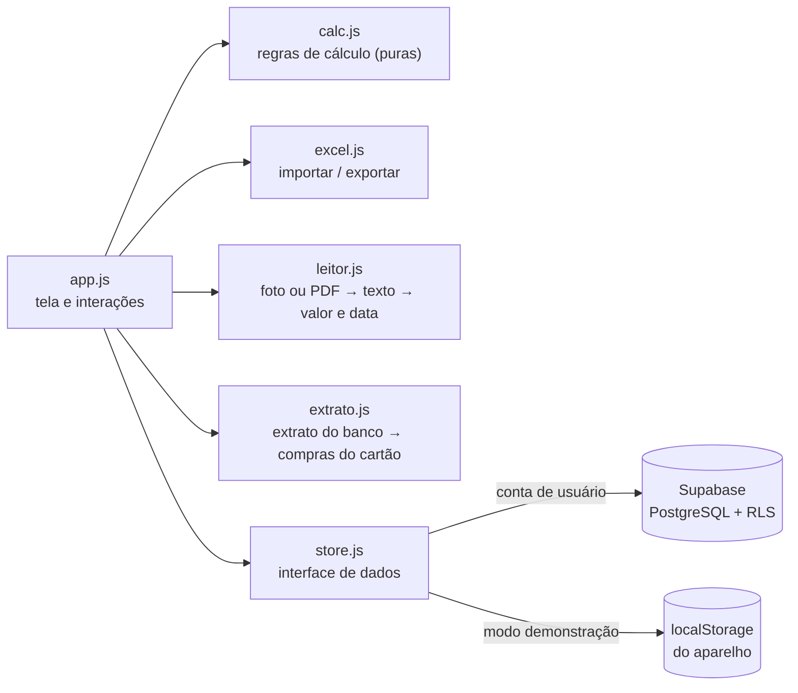
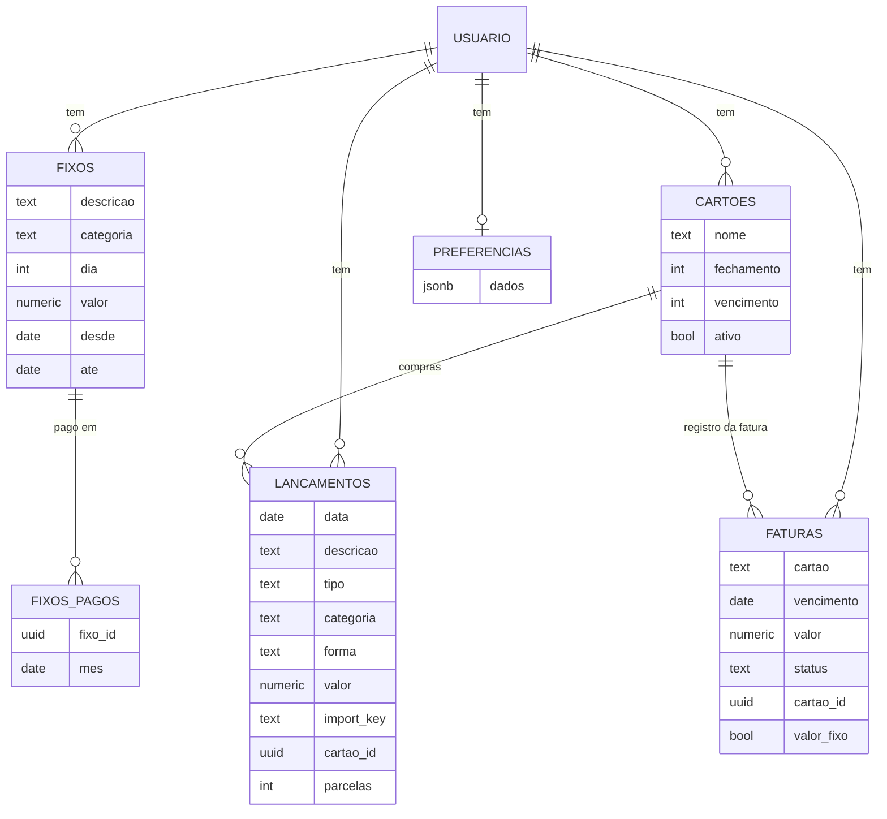

# Meus Gastos — controle de gastos pessoal (PWA)

App web instalável no celular para **lançar gastos no dia a dia e acompanhar quanto o mês vai custar**. Cada pessoa tem sua conta, e os dados ficam salvos na nuvem com segurança por usuário.

**[▶ Abrir o app](https://meugastos.com.br/)** · **[Site de apresentação](https://meugastos.com.br/site/)** · tem um modo demonstração, não precisa criar conta para testar.

<p align="center">
  
  &nbsp;
  
</p>

<p align="center"></p>

## O problema

Eu controlava meus gastos numa planilha do Excel que só mostrava o saldo depois que o mês acabava. Queria ver **durante o mês** quanto já tinha gasto, quanto ainda ia pagar de contas fixas e cartão, e para onde o dinheiro estava indo. Também queria lançar tudo pelo celular, na hora do gasto.

## Funcionalidades

- **Lançamento rápido** de gastos, entradas e dinheiro guardado, com categoria e forma de pagamento. Todo lançamento pode ser **editado** ou excluído.
- **Custo do mês em tempo real** e **previsão de fechamento**, que mistura o ritmo atual com a média dos meses anteriores e não repete compras pontuais grandes.
- **Gastos fixos** cadastrados uma vez: mensais (aluguel, internet) ou semanais (Uber de toda sexta, terapia), com marcação de "pago" a cada ocorrência. Quando o valor muda (o aluguel subiu), a alteração pode valer **só do mês em diante**, sem mexer nos meses anteriores.
- **Entradas fixas**, como o salário: cadastradas uma vez, são lançadas sozinhas em todo mês, no dia escolhido.
- **Cartão de crédito com fatura automática**: a pessoa cadastra o cartão com o dia de fechamento e o de vencimento, e o app monta cada fatura sozinho a partir das compras, incluindo as **parceladas** e os fixos cobrados no cartão. O que é comprado no cartão só pesa no mês em que a fatura vence. Dá para abrir a fatura, ver o que tem dentro, corrigir o valor se o banco cobrou diferente e marcar como paga. Faturas também podem ser lançadas à mão.
- **Importar o extrato do cartão**: o arquivo que o banco exporta (CSV, OFX ou Excel) vira uma lista de compras para conferir, com categoria sugerida, e todas são lançadas de uma vez no cartão. A fatura é montada pela soma delas. Parcelas, pagamento da fatura e estornos são reconhecidos, e importar de novo um arquivo mais recente só traz as compras que faltam. No OFX (o formato que o Nubank exporta), o app também aproveita o nome do banco, o período da fatura e o vencimento para escolher a fatura certa e, se ainda não houver cartão, cadastrá-lo com os dias que vêm no arquivo. Um arquivo de exemplo está em [`modelo/extrato-cartao-exemplo.csv`](modelo/extrato-cartao-exemplo.csv).
- **Leitor por foto ou PDF**: a pessoa fotografa ou escolhe o arquivo de um comprovante (Pix, boleto, cupom, maquininha), da fatura do cartão ou do holerite, e o app preenche valor, data e descrição. Da fatura, lê só o total e o vencimento; do holerite, o valor líquido, que entra como entrada. PDF com senha é aberto depois de a pessoa digitar a senha. A leitura é feita no próprio aparelho, sem enviar o arquivo para servidor, e nada é salvo antes de a pessoa conferir.
- **Resumo que se explica**: a tela abre dizendo quanto sobra (ou falta) no mês e mostra, em uma régua colorida, para onde o dinheiro vai: contas fixas, dia a dia, faturas, guardado e sobra. "Entenda essa conta" detalha a soma com os números da pessoa. Quando o mês fica no vermelho, o quadro muda de cor.
- **Quanto dá para gastar por dia**: a sobra dividida pelos dias que faltam, e a previsão de como o mês fecha no ritmo atual.
- **Seu dia**: o que foi gasto hoje, o botão "Não gastei nada" e a sequência de dias anotados, para criar o hábito de abrir o app.
- **Limites de gasto**: um limite para o mês e limites por categoria, em uma aba própria. O app mostra quanto do limite já foi usado, avisa na hora ao lançar e manda e-mail e notificação quando a pessoa chega a 80% do limite, passa dele ou passa em mais de 20%.
- **Próximos vencimentos logo abaixo**: as contas dos próximos 30 dias, com as atrasadas em destaque, contagem de dias ("em 10 dias vence a fatura, R$ 299"), botão "Já paguei" e alerta quando o mês está ou vai fechar no vermelho.
- **Avisos por e-mail e notificação no celular**: de manhã, só nos dias em que há conta atrasada ou vencendo em até 3 dias. A pessoa liga e desliga em Ajustes.
- **Dinheiro guardado** separado do saldo, por destino (reserva de emergência, investimentos e outros), com guardar e retirar.
- **Saldo acumulado**: o que sobrou ou faltou passa para o mês seguinte, se a pessoa quiser, partindo de um **saldo inicial** (quanto ela já tinha, ou devia, quando começou).
- **Categorias personalizáveis** por usuário, na tela de Ajustes.
- **Gráficos**: custo acumulado no mês comparado às entradas, e custo por categoria.
- **Detalhe com um toque**: tocar em um quadro (custo, entradas, saldo, guardado, fixos, faturas) ou em uma categoria do gráfico abre a lista do que compõe aquele valor.
- **Importar e exportar Excel**: lê o modelo da pasta [`modelo/`](modelo/) e também planilhas antigas em formato livre. Reimportar a mesma planilha não duplica lançamentos.
- **Login por e-mail** com Supabase Auth e isolamento de dados por usuário, via Row Level Security no PostgreSQL.
- **Feito para o celular**: uma tela por vez, barra de navegação embaixo, botão "+" para lançar em tela cheia com teclado numérico e listas em formato de cartão, separadas por dia. Tocar em um lançamento abre a edição. Cada categoria tem a sua cor, a mesma no gráfico e nas listas. No computador, o mesmo app vira um painel completo.
- **PWA**: instalável no Android e no iPhone, abre em tela cheia. O tema escuro é o padrão, e o claro pode ser escolhido em Ajustes.
- **Modo demonstração** com dados de exemplo guardados só no aparelho, para quem quiser testar sem criar conta.

## Tecnologias

| Camada | Escolha | Por quê |
|---|---|---|
| Interface | HTML, CSS e JavaScript puro (ES Modules) | Sem etapa de build: o repositório vai direto para o GitHub Pages |
| Gráficos | SVG desenhado à mão | Leve, responsivo e sem dependência |
| Banco de dados | Supabase (PostgreSQL) | SQL de verdade, com login pronto e plano gratuito |
| Segurança | Row Level Security | Cada usuário só lê e escreve as próprias linhas, garantido pelo banco |
| Excel | SheetJS | Leitura e escrita de `.xlsx` no navegador |
| Leitor por foto ou PDF | Tesseract.js (foto) e pdf.js (PDF), carregados só quando o leitor é usado | Leem o texto no aparelho, de graça e sem enviar o arquivo para fora |
| App instalável | Web App Manifest + Service Worker | Ícone na tela inicial e abertura em tela cheia |
| Avisos | Supabase Edge Function + agendamento no banco (pg_cron) | E-mail (Resend ou Brevo) e Web Push, sem biblioteca externa |
| Testes | `node:test` | Regras de cálculo, importação, extrato do cartão, leitor e servidor de avisos testados sem dependências |

## Arquitetura



A tela não sabe onde os dados estão guardados: ela usa a interface de `store.js`, que tem duas implementações, uma para o Supabase e outra local para a demonstração. As regras de negócio ficam em `calc.js`, como funções puras, e por isso são fáceis de testar.

### Regras de cálculo

- **Custo do mês** = gastos do dia a dia fora do cartão + gastos fixos fora do cartão + faturas de cartão que vencem no mês.
- **Cartão**: compras e fixos no cartão não entram no custo na hora. A cobrança entra no mês de vencimento da fatura.
- **Em que fatura cai uma compra**: compras feitas antes do dia de fechamento entram na fatura que fecha naquele mês; do dia do fechamento em diante, na seguinte. A fatura vence no próximo dia de vencimento depois do fechamento.
- **Parcelas**: uma compra em N vezes entra em N faturas seguidas. Os centavos que sobram da divisão ficam na primeira parcela.
- **Valor da fatura**: a soma das compras, a menos que a pessoa corrija o valor à mão. No gráfico por categoria, cada compra da fatura aparece na sua categoria.
- **Fixo alterado a partir de um mês**: o fixo antigo é encerrado no mês anterior e um novo começa no mês escolhido. O passado não muda.
- **Saldo acumulado** = saldo inicial + saldo dos meses anteriores + saldo do mês.
- **Sobra do mês** = entradas − custo − dinheiro guardado; é o saldo do mês, mostrado em partes na régua.
- **Pode gastar por dia** = sobra ÷ dias que faltam no mês, contando hoje (zero quando não há sobra).
- **Limite do mês**: compara o custo do mês com o valor definido. Níveis de aviso: 80% do limite, acima do limite e mais de 20% acima. Cada nível gera um aviso por mês.
- **Entradas** = entradas lançadas + entradas fixas do mês.
- **Saldo do mês** = entradas − custo − dinheiro guardado no mês (guardou menos retirou).
- **Dinheiro guardado** = soma de tudo que foi guardado menos o que foi retirado, por destino.
- **Previsão** (mês atual): com histórico, mistura o ritmo do mês com a média dos últimos 3 meses, dando mais peso ao histórico no começo do mês. Sem histórico, mantém a média diária sem repetir compras pontuais grandes, e não projeta nada nos primeiros dias ou com poucos lançamentos.
- **Próximos vencimentos**: faturas em aberto e fixos não pagos do mês atual e do próximo, até 30 dias à frente, mais os atrasados. Fixos cobrados no cartão não aparecem soltos: são pagos junto com a fatura.

### Modelo de dados



A fatura de um cartão cadastrado não é guardada: ela é calculada a partir das compras. A tabela `faturas` guarda as faturas lançadas à mão e, para as calculadas, só o que a pessoa decidiu (se pagou, e o valor corrigido quando `valor_fixo` é verdadeiro).

O esquema completo, com as políticas de segurança e a visão `resumo_mensal` para análises em SQL, está em [`supabase/schema.sql`](supabase/schema.sql).

## Como colocar no ar (≈ 15 minutos, tudo gratuito)

### 1. Banco de dados (Supabase)

1. Crie uma conta em [supabase.com](https://supabase.com) e clique em **New project**.
2. Abra **SQL Editor → New query**, cole o conteúdo de [`supabase/schema.sql`](supabase/schema.sql) e clique em **Run**.
3. Em **Project Settings → API**, copie a **Project URL** e a chave **anon public** e cole em [`js/config.js`](js/config.js).

   > A chave `anon` é pública por design. Quem protege os dados são as políticas de RLS do passo 2.

### 2. Publicar (GitHub Pages)

1. Crie um repositório público chamado `controle-gastos-pwa` e envie estes arquivos.
2. Em **Settings → Pages**, escolha **Deploy from a branch**, depois `main` e `/ (root)`, e salve.
3. Em 1 ou 2 minutos, o app estará no endereço do GitHub Pages (`https://SEU-USUARIO.github.io/controle-gastos-pwa/`). Para usar um domínio próprio, aponte o DNS para o GitHub Pages e informe o domínio em **Settings → Pages → Custom domain**; o arquivo `CNAME` deste repositório guarda esse nome.

### 3. Ligar o login ao endereço publicado

No Supabase, abra **Authentication → URL Configuration** e coloque o endereço do GitHub Pages em **Site URL** e em **Redirect URLs**. Assim, os e-mails de confirmação e de "esqueci a senha" voltam para o app.

### 4. Avisos por e-mail e notificação (opcional)

1. No Supabase, rode [`supabase/avisos.sql`](supabase/avisos.sql): cria as tabelas dos avisos e o agendamento diário (8h de Brasília).
2. Publique a função [`supabase/functions/avisos`](supabase/functions/avisos) (`supabase functions deploy avisos --no-verify-jwt`).
3. Para o e-mail, crie uma conta no [Resend](https://resend.com), verifique o seu domínio, gere uma chave de API e cadastre, em **Edge Functions → Secrets**, `RESEND_API_KEY` (a chave) e `AVISOS_REMETENTE` (por exemplo `avisos@seudominio.com.br`). O servidor também aceita o Brevo, com `BREVO_API_KEY`. Sem nenhuma chave, só as notificações funcionam.
4. No app, em **Ajustes → Avisos de contas**, ligue a notificação no aparelho e use **Enviar um aviso de teste agora**.

A função confere a si mesma em `/functions/v1/avisos?autoteste=1` (regras e criptografia, sem tocar no banco). As chaves das notificações são criadas pelo servidor e ficam em uma tabela que só ele lê.

### 5. Instalar no celular

- **Android (Chrome):** abra o endereço e toque em **Instalar app**, ou use o menu ⋮ → **Instalar app**.
- **iPhone (Safari):** toque em **Compartilhar** e depois em **Adicionar à Tela de Início**.

## Rodar no computador

```bash
npm start      # servidor local em http://localhost:5173
npm test       # testes das regras de cálculo e da importação
```

Sem o `js/config.js` preenchido, o app abre direto com a opção de demonstração.

## Estrutura

```
├── index.html              tela de entrada e app
├── css/style.css           tema claro/escuro, layout responsivo
├── js/
│   ├── app.js              interface e eventos
│   ├── calc.js             regras de cálculo (testadas)
│   ├── store.js            dados: Supabase ou local (demo)
│   ├── excel.js            importar / exportar .xlsx
│   ├── extrato.js          extrato do cartão em CSV, OFX ou Excel → lista de compras (testado)
│   ├── leitor.js           leitor por foto ou PDF: lê o arquivo e interpreta o texto (testado)
│   └── config.js           URL e chave do Supabase
├── site/                   página de apresentação do app (preço e link de compra em OFERTA, no fim do index.html)
├── supabase/schema.sql     tabelas, RLS e visão de resumo
├── supabase/avisos.sql     tabelas e agendamento dos avisos
├── supabase/functions/     servidor de avisos (e-mail e notificação)
├── modelo/                 planilha modelo para importar
├── tests/                  testes com node:test
├── manifest.webmanifest    dados do app instalável
└── sw.js                   service worker
```

## Próximos passos

- Metas de gasto por categoria, com alerta quando passar de uma porcentagem.
- Painel de análise no Power BI ou no Metabase, conectado à visão `resumo_mensal`.
- Categorização automática de lançamentos pela descrição, usando o histórico do usuário.

## Autor

**Marcos Henrique Barbosa Santos**, estudante de Ciência de Dados.
[LinkedIn](https://www.linkedin.com/in/SEU-LINKEDIN) · [GitHub](https://github.com/MarcosHenriqueBarbosaSantos)

Licença [MIT](LICENSE).
