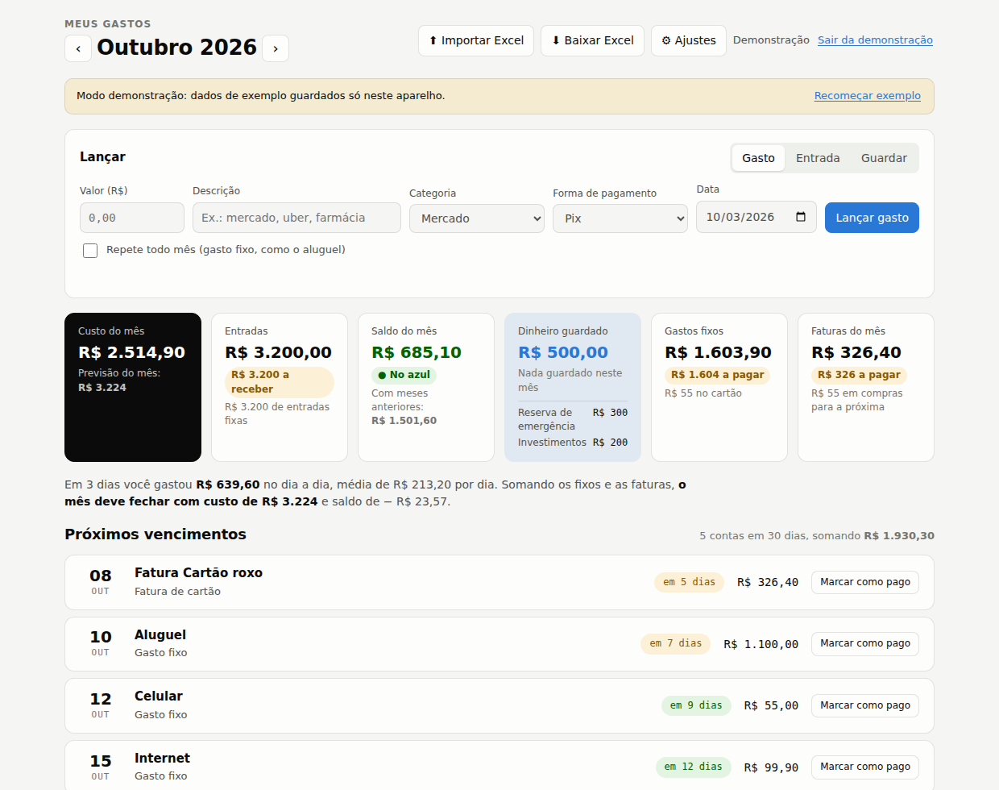
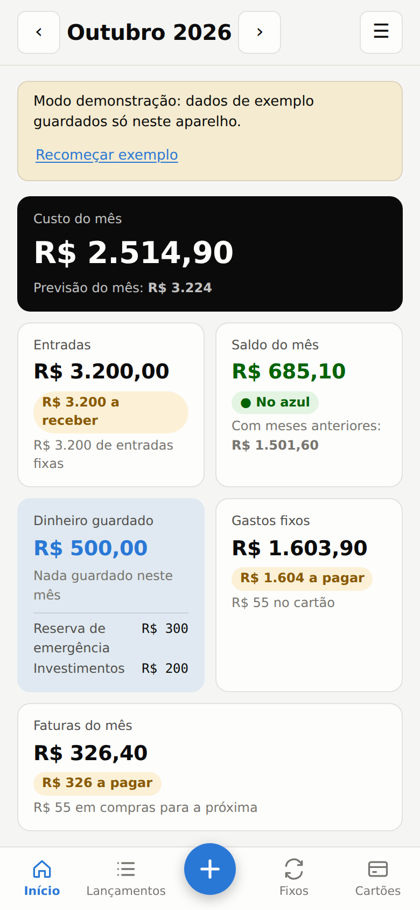
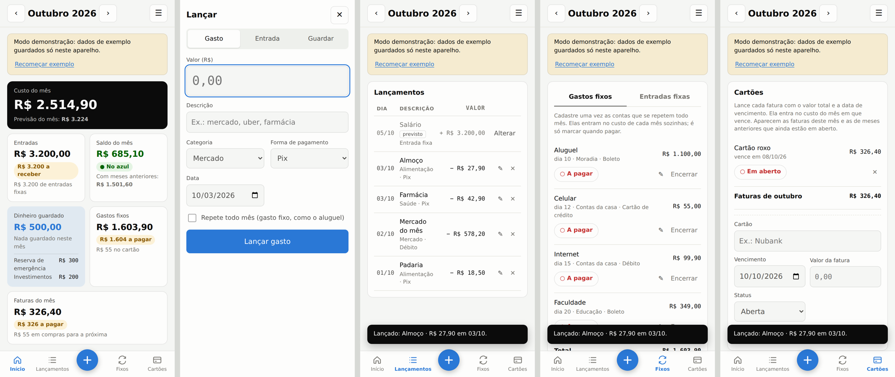
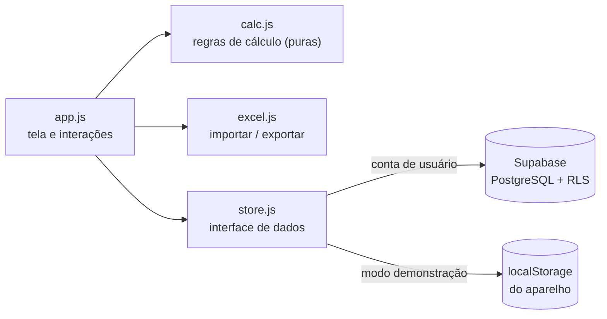
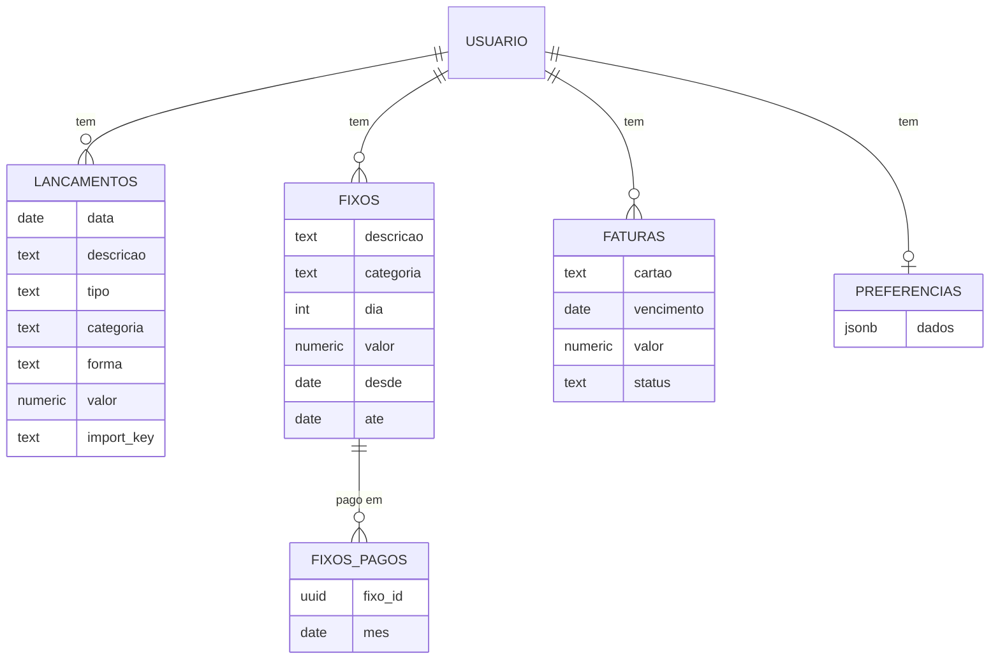

# Meus Gastos — controle de gastos pessoal (PWA)

App web instalável no celular para **lançar gastos no dia a dia e acompanhar quanto o mês vai custar**. Cada pessoa tem sua conta, e os dados ficam salvos na nuvem com segurança por usuário.

**[▶ Abrir o app](https://marcoshenriquebarbosasantos.github.io/controle-gastos-pwa/)** · tem um modo demonstração, não precisa criar conta para testar.

<p align="center">
  
  &nbsp;
  
</p>

<p align="center"></p>

## O problema

Eu controlava meus gastos numa planilha do Excel que só mostrava o saldo depois que o mês acabava. Queria ver **durante o mês** quanto já tinha gasto, quanto ainda ia pagar de contas fixas e cartão, e para onde o dinheiro estava indo. Também queria lançar tudo pelo celular, na hora do gasto.

## Funcionalidades

- **Lançamento rápido** de gastos, entradas e dinheiro guardado, com categoria e forma de pagamento. Todo lançamento pode ser **editado** ou excluído.
- **Custo do mês em tempo real** e **previsão de fechamento**, que mistura o ritmo atual com a média dos meses anteriores e não repete compras pontuais grandes.
- **Gastos fixos** cadastrados uma vez e contados todo mês, com marcação de "pago" por mês.
- **Entradas fixas**, como o salário: cadastradas uma vez, são lançadas sozinhas em todo mês, no dia escolhido.
- **Cartão de crédito pela fatura**: o que é comprado no cartão só pesa no mês em que a fatura vence.
- **Próximos vencimentos**: quadro com as contas dos próximos 30 dias ("em 10 dias vence a fatura, R$ 299"), com aviso de atraso e botão para marcar como pago.
- **Dinheiro guardado** separado do saldo, por destino (reserva de emergência, investimentos e outros), com guardar e retirar.
- **Saldo acumulado**: o que sobrou ou faltou passa para o mês seguinte, se a pessoa quiser.
- **Categorias personalizáveis** por usuário, na tela de Ajustes.
- **Gráficos**: custo acumulado no mês comparado às entradas, e custo por categoria.
- **Importar e exportar Excel**: lê o modelo da pasta [`modelo/`](modelo/) e também planilhas antigas em formato livre. Reimportar a mesma planilha não duplica lançamentos.
- **Login por e-mail** com Supabase Auth e isolamento de dados por usuário, via Row Level Security no PostgreSQL.
- **Feito para o celular**: uma tela por vez, barra de navegação embaixo, botão "+" para lançar em tela cheia com teclado numérico e listas em formato de cartão. No computador, o mesmo app vira um painel completo.
- **PWA**: instalável no Android e no iPhone, abre em tela cheia e tem tema claro e escuro.
- **Modo demonstração** com dados de exemplo guardados só no aparelho, para quem quiser testar sem criar conta.

## Tecnologias

| Camada | Escolha | Por quê |
|---|---|---|
| Interface | HTML, CSS e JavaScript puro (ES Modules) | Sem etapa de build: o repositório vai direto para o GitHub Pages |
| Gráficos | SVG desenhado à mão | Leve, responsivo e sem dependência |
| Banco de dados | Supabase (PostgreSQL) | SQL de verdade, com login pronto e plano gratuito |
| Segurança | Row Level Security | Cada usuário só lê e escreve as próprias linhas, garantido pelo banco |
| Excel | SheetJS | Leitura e escrita de `.xlsx` no navegador |
| App instalável | Web App Manifest + Service Worker | Ícone na tela inicial e abertura em tela cheia |
| Testes | `node:test` | Regras de cálculo e importação testadas sem dependências |

## Arquitetura



A tela não sabe onde os dados estão guardados: ela usa a interface de `store.js`, que tem duas implementações, uma para o Supabase e outra local para a demonstração. As regras de negócio ficam em `calc.js`, como funções puras, e por isso são fáceis de testar.

### Regras de cálculo

- **Custo do mês** = gastos do dia a dia fora do cartão + gastos fixos fora do cartão + faturas de cartão que vencem no mês.
- **Cartão**: compras e fixos no cartão não entram no custo na hora. A cobrança entra no mês de vencimento da fatura.
- **Entradas** = entradas lançadas + entradas fixas do mês.
- **Saldo do mês** = entradas − custo − dinheiro guardado no mês (guardou menos retirou).
- **Dinheiro guardado** = soma de tudo que foi guardado menos o que foi retirado, por destino.
- **Previsão** (mês atual): com histórico, mistura o ritmo do mês com a média dos últimos 3 meses, dando mais peso ao histórico no começo do mês. Sem histórico, mantém a média diária sem repetir compras pontuais grandes.
- **Próximos vencimentos**: faturas em aberto e fixos não pagos do mês atual e do próximo, até 30 dias à frente, mais os atrasados.

### Modelo de dados



O esquema completo, com as políticas de segurança e a visão `resumo_mensal` para análises em SQL, está em [`supabase/schema.sql`](supabase/schema.sql).

## Como colocar no ar (≈ 15 minutos, tudo gratuito)

### 1. Banco de dados (Supabase)

1. Crie uma conta em [supabase.com](https://supabase.com) e clique em **New project**.
2. Abra **SQL Editor → New query**, cole o conteúdo de [`supabase/schema.sql`](supabase/schema.sql) e clique em **Run**.
3. Em **Project Settings → API**, copie a **Project URL** e a chave **anon public** e cole em [`js/config.js`](js/config.js).

   > A chave `anon` é pública por design. Quem protege os dados são as políticas de RLS do passo 2.

### 2. Publicar (GitHub Pages)

1. Crie um repositório público chamado `controle-gastos-pwa` e envie estes arquivos.
2. Em **Settings → Pages**, escolha **Deploy from a branch**, depois `main` e `/ (root)`, e salve.
3. Em 1 ou 2 minutos, o app estará em `https://marcoshenriquebarbosasantos.github.io/controle-gastos-pwa/`.

### 3. Ligar o login ao endereço publicado

No Supabase, abra **Authentication → URL Configuration** e coloque o endereço do GitHub Pages em **Site URL** e em **Redirect URLs**. Assim, os e-mails de confirmação e de "esqueci a senha" voltam para o app.

### 4. Instalar no celular

- **Android (Chrome):** abra o endereço e toque em **Instalar app**, ou use o menu ⋮ → **Instalar app**.
- **iPhone (Safari):** toque em **Compartilhar** e depois em **Adicionar à Tela de Início**.

## Rodar no computador

```bash
npm start      # servidor local em http://localhost:5173
npm test       # testes das regras de cálculo e da importação
```

Sem o `js/config.js` preenchido, o app abre direto com a opção de demonstração.

## Estrutura

```
├── index.html              tela de entrada e app
├── css/style.css           tema claro/escuro, layout responsivo
├── js/
│   ├── app.js              interface e eventos
│   ├── calc.js             regras de cálculo (testadas)
│   ├── store.js            dados: Supabase ou local (demo)
│   ├── excel.js            importar / exportar .xlsx
│   └── config.js           URL e chave do Supabase
├── supabase/schema.sql     tabelas, RLS e visão de resumo
├── modelo/                 planilha modelo para importar
├── tests/                  testes com node:test
├── manifest.webmanifest    dados do app instalável
└── sw.js                   service worker
```

## Próximos passos

- Metas de gasto por categoria, com alerta quando passar de uma porcentagem.
- Avisos de vencimento por notificação no celular ou por e-mail.
- Painel de análise no Power BI ou no Metabase, conectado à visão `resumo_mensal`.
- Categorização automática de lançamentos pela descrição, usando o histórico do usuário.

## Autor

**Marcos Henrique Barbosa Santos**, estudante de Ciência de Dados.
[LinkedIn](https://www.linkedin.com/in/SEU-LINKEDIN) · [GitHub](https://github.com/MarcosHenriqueBarbosaSantos)

Licença [MIT](LICENSE).
